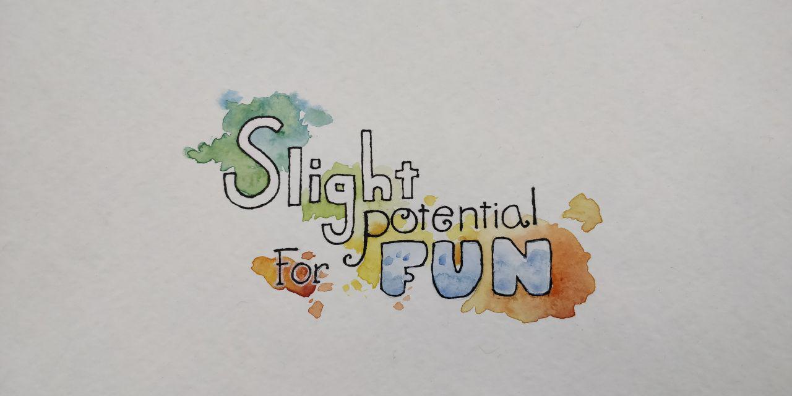
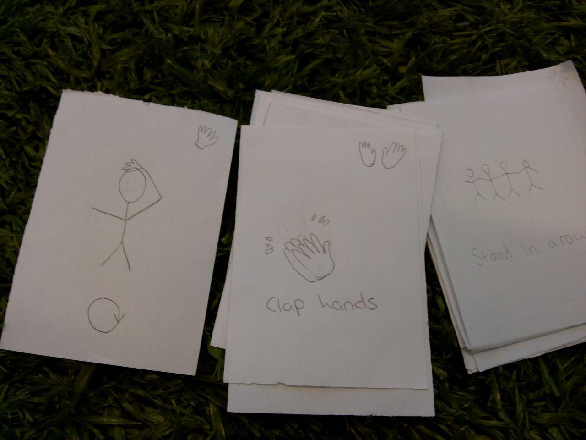

# SlightPotentialForFun
Slight Potential For Fun - GGJ19 FGJ19 analogue party game

## Game Rules

 * Players can join and exit at any point
 * To begin 4 cards are drawn and placed on the play. If there are cards with limitation the incompatible cards are discarded and new ones are drawn to get the 4 on the play.
 * Player in turn draws two cards and chooses which one to play, add to the play e.g. add at the end of the sequence.
 * Said player then acts as game master and instructs other players what they should do e.g. execute the play. Game master does not take part in the play but judges if the other players were successful.
 * If players were successful the next player in turn will then in turn draw two cards and act as game master as described. If players fail then there are different options how to continue. The play can be emptied totally and start with four new cards or remove the oldest card from the play. 

## Card rules

 * There are hand cards and leg cards. There can exist maximum two of each symbols on the play so new said cards will replace one or more of the previous cards. Player can choose which to replace if possible.
 * There are continuous cards. The continuos actions should be effective all the time until the card is not anymore in the play.
 * Action cards there can be only one on the play. If new is played it will replace the old one. The action on action card should be then executed while all the other cards are effective.
 
 
 ## Cards
 
 ### Regular
 
  * Move in a circle
  * Link arms
  * Minimum 50 % of the players close their eyes.
  * Be in a row
  * Sit
  * Hug
  
 ### Action
 * A: Jump
 * AH: Shake hands
 * A: Squat

 ### Leg & Hand (H = one hand, 2H = two hands, Legs the same way)
 
  * H: Hold hands
  * H: Put finger on someone else's forehead (continuos)
  * H: 50 % of the hands on the floor
  * H: Put finger on your nose (continuous)
  * H: Put hand on top of your head (continous)
  * 2H: Cover your ears
  * 2H: Clap hands
  * L: Knees touching
  * L: Tip toe
  * L: 50% of the legs on the floor (continous)
  * L: foot on someone else's knee
 
 ## Preparations for the game
 
 In order to play the game the aforementioned cards shouls be put on some kind of card material, printed on paper and cut to cards of same size. 
 
 
 
 ## Different game modes
 
 ### Draw 3
 
 Other way of playing the game is using the same cars so that the player in turn draws 3 cards and then the players try to complete the indicated play. If success then the player discards two of those and gives one of the cards to the next player. Next player draws 3 cards and adds the one given card to the play and then the players try to complete the play of 4 cards. In next turn it is then possible to have a play of 5 of keep it at 4 by either drawing more cards or passing on more cards. Those are simple tweaks and choices to the rules to decide before starting the game.
